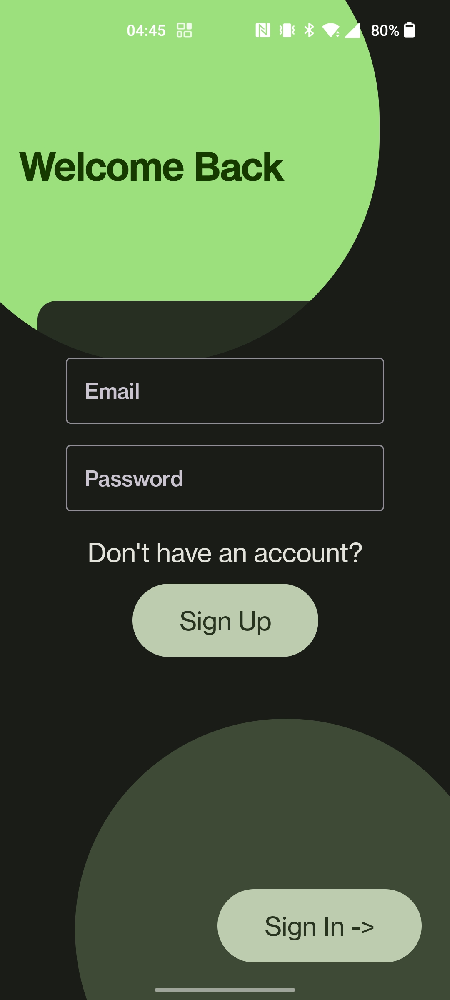
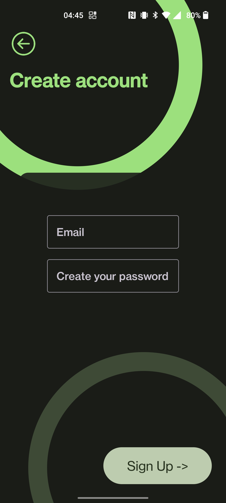
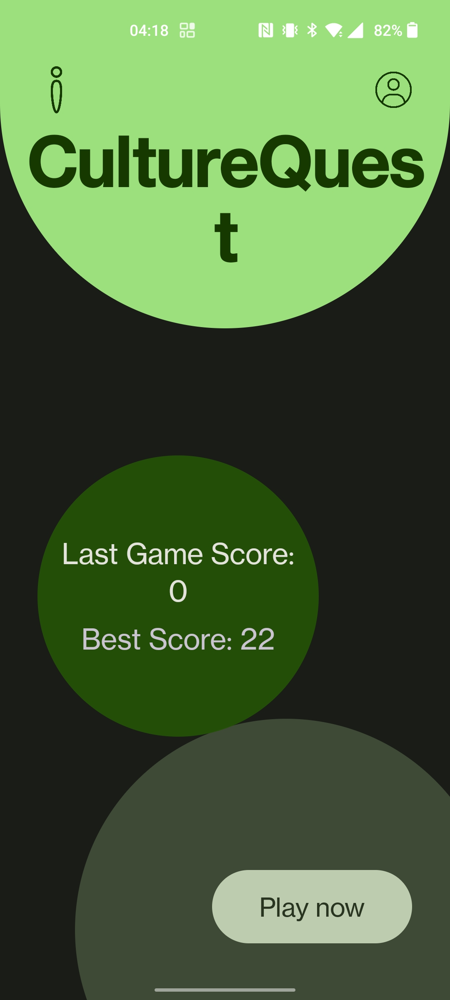
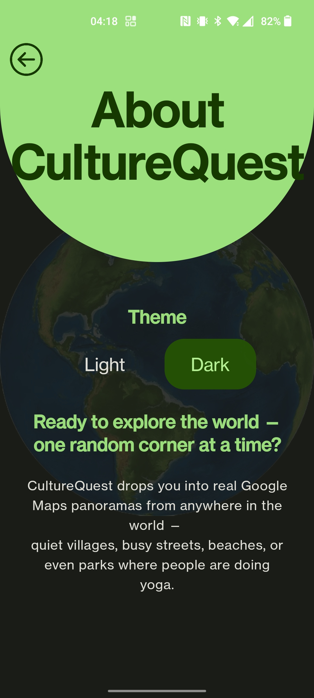
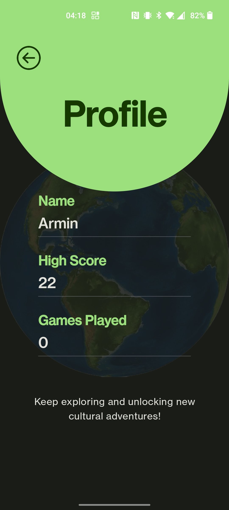
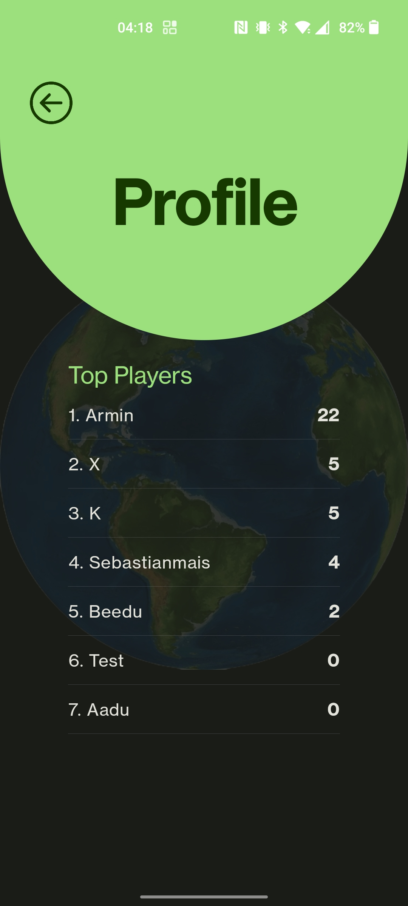
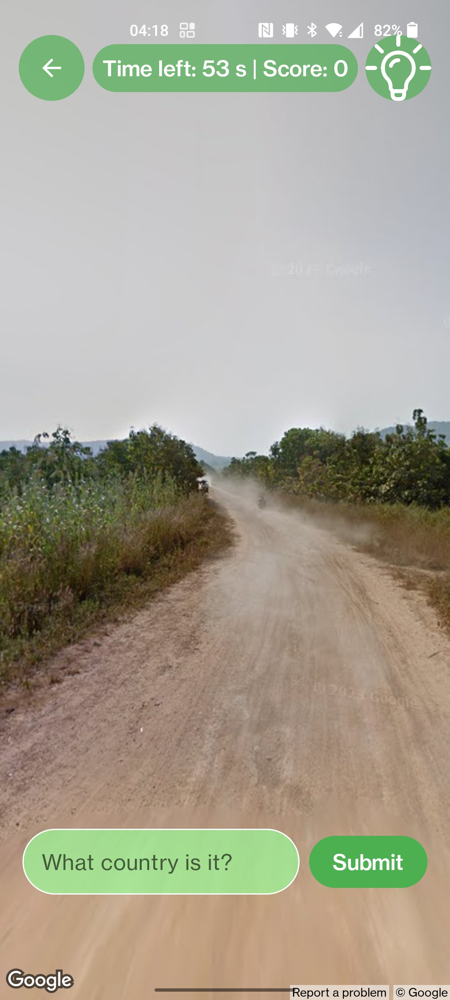
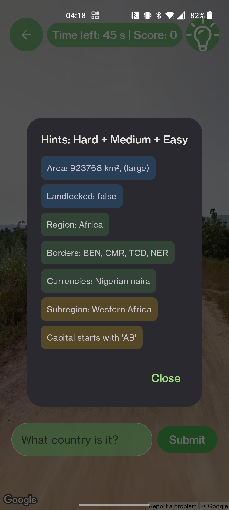
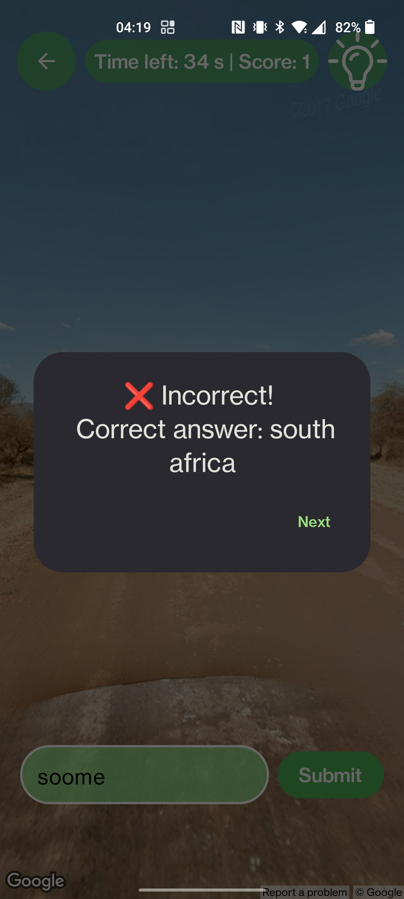

# CultureQuest
CultureQuest is a mobile game where players guess the country based on real-world panorama images, implemented using the Google Maps API and Android SDK.

The game is time-sensitive — each round lasts 1 minute, challenging players to think fast. To assist, tier-based hints (Easy, Medium, Hard) can be unlocked at any point during the game. Player performance is tracked through a score system and leaderboard, making the experience both fun and competitive.

Team Members:
 

- **Armin Liiv** — Developer, Editor  
  [GitHub Profile](https://github.com/Rover-M) 

- **Caroline Markov** — Researcher, Developer  
  [GitHub Profile](https://github.com/CarolineMarkov)  

- **Kaspar Aednik** — Developer, Project Manager  
  [Github Profile](https://github.com/Lontloom)

- **Riika Seeba** — Developer, Editor  
  [Github Profile](https://github.com/riikaseeba)  

- **Sebastian Mais** — Developer, Presenter   
  [GitHub Profile](https://github.com/S33bu)

 

### Goals
- Deliver an engaging geography quiz experience
- Integrate modern Android technologies seamlessly
- Establish a clean, maintainable MVVM architecture
- Demonstrate professional development workflows
- Build a scalable foundation for future features

### Main Features
- **Game Page:** Core experience powered by **Google Street View**  
- **Hint System:** Tier-based hints (Easy, Medium, Hard) available during gameplay  
- **Leaderboard:** Displays top players and their scores  
- **About Page:** Information about the game and developers  
- **Sign In / Log In:** User authentication to track individual scores and progress  

For a more detailed overview and upcoming features, visit our [**Wiki Page**](https://github.com/S33bu/CultureQuest/wiki).

### Installation/Build instructions
1. Prerequisites: Install [Android Studio](https://developer.android.com/studio)
2. Clone Repository: git clone https://github.com/S33bu/CultureQuest.git
3. Open Project: Launch Android Studio and select Open, then navigate to the cloned folder.
4. Firebase Configuration: Ensure the google-services.json file is present in the app/directory
5. (For the API keys) Look for instructions in the local.properties.template file
6. Gradle sync: Click File > Sync Project with Gradle Files. Wait for "Build Successful" message.
7. Run application: select a physical device or emulator and click the green play button

### Development Stack

#### Tools & Environment
- IDE: Android Studio
- Version Control: GitHub (with Projects & Wiki)
- Project Management: Jira
- Design: Figma

#### Languages & Core SDKs
- Language: Kotlin
- Concurrency: Kotlin Coroutines
- UI Framework: Jetpack Compose
- Design System: Material 3
- Navigation: Compose Navigation

#### Key Libraries & Dependencies
- Architecture: AndroidX Lifecycle, ViewModel
- Local Storage: Room Database (with KSP)
- Data Serialization: kotlinx-serialization
- Authentication: Firebase Authentication
- Mapping: Google Maps SDK, Maps Compose
- Geocoding: Google Geocoding API
- Local Data: mledoze/countries dataset (embedded in assets)

#### External Services & APIs
- Google Maps Platform (Street View, Geocoding)
- Firebase (Authentication, Firestore)

### Usage Guide

### App Launch & Authentication
When the app is launched, it first checks whether the user is already authenticated.

- If the user has previously logged in and the session is still valid, the app **automatically navigates to the Home screen**.
- If no active session exists, the user is shown the authentication screens, where they can either sign in or create a new account.

---

#### Sign In – Existing Users

Existing users can enter their **email** and **password** and tap **“Sign In”**.  
After successful authentication, the user is redirected to the Home screen.

---

#### Sign Up – Creating a New Account

Users without an existing account can navigate to the **Create Account / Sign Up** screen.  
By entering an **email** and **password** and tapping **“Sign Up”**, a new account is created.  
After successful registration, the user is logged in automatically and redirected to the Home screen.

---

#### Home Screen – Starting the Game

The Home screen displays the player’s **last game score** and **best score**.  
Tapping **“Play now”** starts a new one-minute game session.

---

#### About Page – App Information & Theme

From the Home screen, the user can navigate to the **About page**.  
This page explains the concept behind CultureQuest and allows switching between **Light** and **Dark** themes, which are applied instantly across the app.

---

#### Profile Page – Player Statistics

The Profile page shows the player’s **name**, **high score**, and **number of games played**, helping track personal progress.

---

### Leaderboard – Top Players

Within the Profile section, the user can view the **leaderboard**, which ranks players based on their scores and adds a competitive element to the game.

---

#### Gameplay – Guessing the Country

During gameplay, the user is shown a **real Google Street View panorama** from a random location.  
The remaining time and current score are displayed at the top of the screen.  
The player types a country name and submits the guess before the timer expires.

---

#### Hints – Assisted Guessing

If assistance is needed, the player can open the **hint panel**.  
Hints are revealed in increasing difficulty levels (**Easy, Medium, Hard**) and provide geographical or cultural clues.  
Using hints helps identify the country but **reduces the score** for a correct answer.

---

#### Correct Answer Feedback

When a correct answer is submitted, a confirmation dialog is shown.  
Points are awarded based on hint usage, and the game continues automatically with the next location.

---

#### Incorrect Answer Feedback

If the answer is incorrect, the correct country is displayed.  
No points are awarded, and the game proceeds to the next location until the session ends.

### Project Structure
The project follows the **MVVM (Model–View–ViewModel)** architectural pattern:

- **data/**: Data layer containing Room-based local persistence, repository implementations, and external data sources (Firebase, Google Maps APIs).
- **ui/screens/**: Stateless Jetpack Compose UI components and screen layouts.
- **ui/viewmodel/**: ViewModels that manage UI state, handle user interactions, and expose state via `StateFlow`.
- **ui/theme/**: Material 3 design system configuration (colors, typography, and shapes).
- **assets/**: Bundled static resources, including the predefined country dataset used for hint generation.
- **res/**: Android resources including drawables, strings for localization, and app icons.
